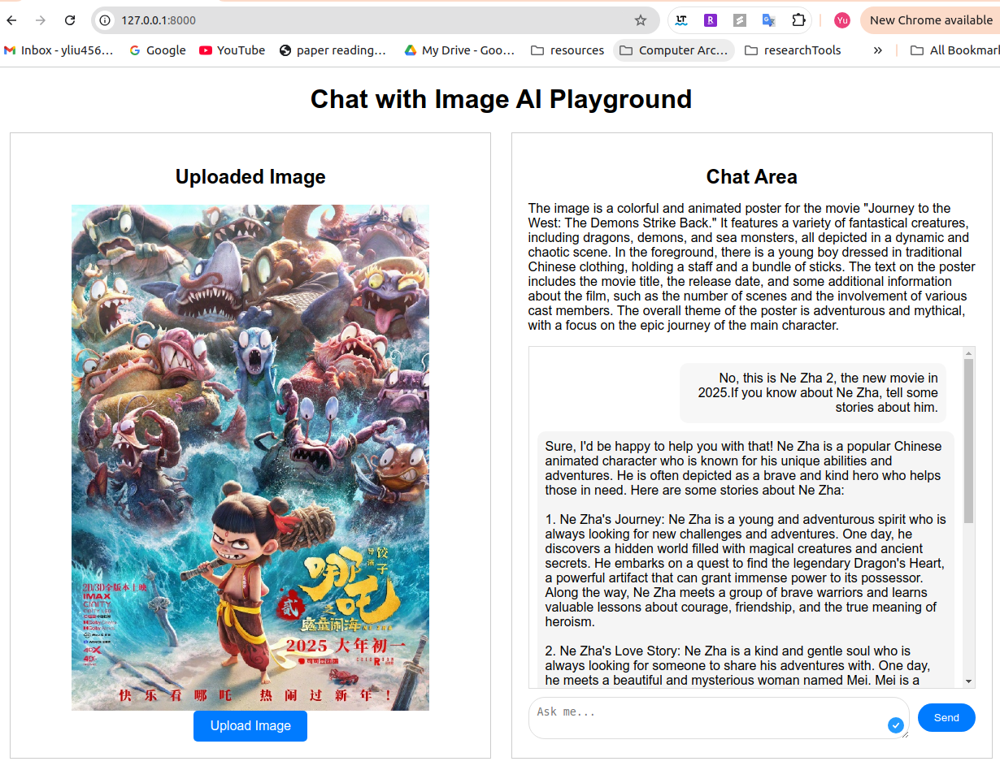

## 🚀 Image understanding playground, engined with DeepSeek Janus Pro 1B + FastAPI
 - This repository is the source code of website, which supports AI image reasonning locally as a server
 - Website is built by using FastAPI
 - Local AI engine is Deepseek Janus Pro 1B, the Multimodal Understanding and Generation Models
 - Below is a screenshot of demo


### Prerequisites:
 - Python 3.10,  anaconda
 - PyTorch >=2.0.1
 - CUDA, GPU suggests no lower than Nvidia RTX3090
 - Ubuntu 22.04/20.04


### Installation:
- Clone this repository and enter to this repository name 
- Create conda environment (optional), e.g. name of web
- Install dependencies in your prefered environment: 

  ```bash
  cd img_chat_deepseek
  conda create --name web python=3.10
  conda activate web
  pip install -e .  
 
### Copy weights of Janus
 - URL: https://huggingface.co/deepseek-ai/Janus-Pro-1B 
 - Copy all files under "File" tab to folder of "Janus-Pro-1B"
 - If you want to use 7B version, download it and revise the associated code in img_ana.py

### Implement
- Enter to this repository folder 
- Under img_chat folder, start server:
```bash 
  uvicorn app.main:app --reload
 ```
- visit 127.0.0.1:8000 in browser

### Acknowledgement
 - The AI model is forked on [deepseek-ai
Janus](https://github.com/deepseek-ai/Janus/tree/main?tab=readme-ov-file).
 - Junus' source code is under the folder of "Janus"
